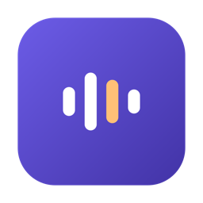

<div align="center">



# Fala

**Ditado por voz 100% local para macOS.**
Segure uma tecla, fale, solte — o texto aparece onde estiver o seu cursor, em
qualquer app. Nada sai do seu Mac.

</div>

---

## O que é

O Fala transcreve sua voz **inteiramente no seu Mac**, usando o Neural Engine do
Apple Silicon. Não existe servidor, não existe conta, não existe telemetria. Depois
que o modelo é baixado uma vez, o app funciona offline para sempre.

Ele foi feito para uma situação específica que os ditados genéricos erram: **português
brasileiro misturado com jargão técnico em inglês**. Ditar *"fazer o deploy no endpoint
do Kubernetes"* costuma produzir "deploi", "endipoint" e "cubernetes" — o Fala tem um
dicionário determinístico para corrigir exatamente isso.

## Como funciona

1. Segure **⌥ direita** (configurável)
2. Fale
3. Solte — o texto é inserido no cursor

Uma pílula flutuante na base da tela mostra o estado: gravando, transcrevendo,
inserido, ou o motivo da falha. Funciona em qualquer aplicativo, porque insere o texto
como se você tivesse colado — sem integração, sem plugin.

## Funcionalidades

**Ditado**
- Atalho global configurável (⌥ direita, ⌥ esquerda ou Fn)
- Captura em qualquer app, texto inserido no cursor
- Até 60 segundos por fala, sem cortes no fim
- Latência de ~100 ms em falas curtas

**Correção de jargão**
- 43 substituições PT-EN embutidas (`deploy`, `Kubernetes`, `Docker Compose`,
  `Postgres`, `staging`…), editáveis por você
- Três níveis de segurança: as regras que poderiam corromper português correto ficam
  desligadas por padrão. `depois` nunca vira `deploy` sozinho, e `brand` só vira
  `branch` perto de vocabulário de git
- Importar e exportar em JSON

**Privacidade**
- Nenhuma chamada de rede depois do download inicial do modelo
- A transcrição vai para a área de transferência marcada como **oculta**: não entra no
  Universal Clipboard (não aparece no seu iPhone) nem no histórico de apps como
  Raycast ou Maccy
- Sua área de transferência anterior é restaurada depois de inserir
- Em campo de senha, o app **recusa** inserir e explica por quê
- O histórico fica só no seu Mac, com "Apagar tudo"

**Interface**
- App da barra de menus, sem ícone no Dock
- Pílula flutuante com seis estados, que respeita "Reduzir movimento"
- Janela de Ajustes: atalho, microfone, dicionário, modelo, privacidade
- Janela de Histórico: busca (sem acento e sem maiúscula), agrupamento por dia,
  copiar, inserir de novo, apagar
- Interface inteira em português, clara e escura

**Áudio**
- Escolha do microfone, com aviso quando um fone Bluetooth entra em modo HFP —
  detectado por taxa de amostragem e transporte, não por casar "AirPods" no nome
- Medidor de nível ao vivo nos Ajustes

## Requisitos

- macOS 14 ou superior
- **Apple Silicon** (M1–M4). Em Mac Intel o app recusa abrir e explica o motivo
- ~480 MB de disco para o modelo, baixado na primeira execução

## Instalação

Baixe o `.dmg`, arraste o Fala para Aplicativos e abra.

**O app não é notarizado**, então na primeira abertura o macOS vai bloqueá-lo. Clique
com o botão direito no app → **Abrir**. O guia completo, com a explicação do que isso
significa, está em [docs/pt-BR/instalacao.md](docs/pt-BR/instalacao.md).

Depois disso o app pede duas permissões: **Microfone** (para ouvir) e **Acessibilidade**
(para detectar o atalho e inserir o texto). Se algo não funcionar,
[docs/pt-BR/permissoes.md](docs/pt-BR/permissoes.md) cobre as duas armadilhas que mais
custam tempo.

Guia de uso: [docs/pt-BR/uso.md](docs/pt-BR/uso.md).

## Status

O ditado ponta a ponta funciona e foi verificado em uso real. Duas ressalvas honestas:

**A precisão ainda não foi validada.** O modelo (NVIDIA Parakeet TDT v3) foi treinado
majoritariamente em **português europeu**, e a medição de qualidade com áudio real está
incompleta — 6 frases, número insuficiente para decidir. O jargão em inglês é onde ele
mais erra, e é exatamente o que o dicionário existe para compensar. Detalhes em
[SPEC.md](SPEC.md) §6.

**As janelas de Ajustes e Histórico são novas** e ainda não passaram por uso
prolongado. Os defeitos conhecidos estão listados em
[docs/architecture.md](docs/architecture.md).

## Desenvolvimento

```bash
swift build                      # compilar
./scripts/test.sh                # 978 testes
swift run Fala doctor            # permissões, atalho, modelo, dicionário
swift run Fala listen 6          # grava 6s e transcreve, sem precisar de .app
```

Para rodar o app de verdade (o atalho e a inserção exigem um `.app` assinado, porque o
macOS concede Acessibilidade ao *processo responsável* — pelo Terminal, quem recebe é
o Terminal):

```bash
./scripts/make-app.sh            # gera build/Fala.app
./scripts/run-app.sh menubar     # lança e acompanha a saída
```

Para distribuir:

```bash
swift scripts/make-icon.swift    # regera o ícone (só se a marca mudar)
./scripts/ship.sh                # gera dist/Fala-<versão>.dmg
```

Use `./scripts/test.sh`, não `swift test`: a biblioteca de testes só existe no toolchain
completo do Xcode, e o wrapper isola o build para não contaminar o `.build`.

**Documentação de projeto** (em inglês): [CLAUDE.md](CLAUDE.md) para as regras,
[SPEC.md](SPEC.md) para os requisitos, [TASKS.md](TASKS.md) para o plano em fases,
[DESIGN.md](DESIGN.md) para a tradução dos mockups, e
[docs/architecture.md](docs/architecture.md) para as decisões e armadilhas já mapeadas.

## Créditos

Reconhecimento de fala: [NVIDIA Parakeet TDT 0.6B v3](https://huggingface.co/nvidia/parakeet-tdt-0.6b-v3)
(CC-BY-4.0) rodando via [FluidAudio](https://github.com/FluidInference/FluidAudio)
(Apache 2.0) em CoreML.
